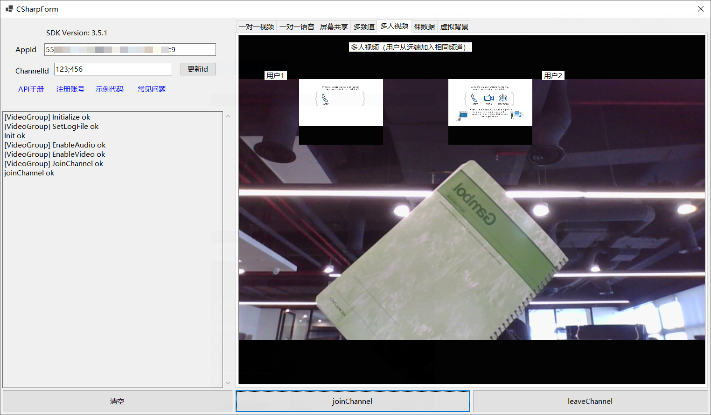

# API-Example-CSharp

*__其他语言版本：__  [__简体中文__](README.zh.md)*

## Overview

The API-Example-CSharp project is an open-source demo that will show you different scenes on how to integrate Agora SDK APIs into your project.

Any scene of this project can run successfully alone.

*image_of_a_running_project*



## Project structure

The project uses a single app to combine a variety of functionalities.

* **Basic demos:**

| Demo                                     | Description                            | APIs                                                                     |
| ---------------------------------------- | -------------------------------------- | ------------------------------------------------------------------------ |
| [JoinChannelAudio][JoinChannelAudioLink] | basic demo to show audio call          | CreateAgoraRtcEngine, Initialize, JoinChannel, LeaveChannel              |
| [JoinChannelVideo][JoinChannelVideoLink] | basic demo to show video call          | CreateAgoraRtcEngine, Initialize, EnableVideo, JoinChannel, LeaveChannel |
| ...                                      | ...                                    | ...                                                                      |

* **Advanced demos:**

| Demo                                           | Description                      | APIs                                                                     |
| ---------------------------------------------- | -------------------------------- | ------------------------------------------------------------------------ |
| [JoinMultipleChannel][JoinMultipleChannelLink] | join from different channel      | CreateAgoraRtcEngine, Initialize, SetChannelProfile, CreateChannel, SetClientRole, EnableAudio、EnableVideo、SetupLocalVideo, JoinChannel, Publish, LeaveChannel |
| [ProcessRawData][ProcessRawDataLink]           | how to get raw data              | CreateAgoraRtcEngine, Initialize, EnableAudio, EnableVideo, JoinChannel, LeaveChannel |
| [ScreenShare][ScreenShareLink]                 | screen share                     | CreateAgoraRtcEngine, Initialize, StartScreenCaptureByDisplayId, EnableVideo,JoinChannel, StopScreenCapture, LeaveChannel |
| [VideoGroup][VideoGroupLink]                   | users join a same channel        | CreateAgoraRtcEngine, Initialize, EnableVideo, JoinChannel, LeaveChannel |
| [VirtualBackground][VirtualBackgroundLink]     | enable virtual background        | CreateAgoraRtcEngine, Initialize, EnableVideo, EnableVirtualBackground, JoinChannel, LeaveChannel |
| ...                                            | ...                              | ...                                                                      |

## How to run the sample project

### Developer Environment Requirements

- Visual Studio 2019+ with C++ (Windows)
- .NET

### Steps to run

*Steps from cloning the code to running the project*

First, create a developer account at [Agora.io](https://dashboard.agora.io/signin/), and obtain an App ID. Then do the following:

1. Clone this repository.

	```bash
	git clone https://github.com/AgoraIO-Community/Agora-C_Sharp-SDK.git
	```
	
2. Open `Agora-C_Sharp-SDK/CSharp-API_Example/CSharp-API_Example.sln` via Visual Studio. select x64 platform. 
Note that you will see compiler errors because you download the SDK package yet.

3. You may download the SDK package by one of the following ways(recommend b):

    a. Download [Agora Video SDK for Windows](https://download.agora.io/sdk/release/iris_3.5.0.3_RTC_Windows_20211118_0343.zip). Unzip the downloaded SDK package and copy all the `.dll` files from `RTC/Agora_Native_SDK_for_Windows_FULL/libs/x86_64` and `x64/Release` to `Agora-C_Sharp-SDK/CSharp-API_Example/binx64/Debug/netcoreapp3.1` folder.
    
    b. In `Solution Explorer`, find `CSharp-API_Example->Dependencies` and right click. Then select `Manage NuGet Packages...`. Click `Browse` button, search `agora_rtc_sdk` and install the package.

4.  Fill your App ID click "update" btn to save. Choose one of the scene that you want to run.

You are all set! Feel free to play with this sample project and explore features of the Agora RTC SDK.

## Feedback

If you have any problems or suggestions regarding the sample projects, feel free to file an issue.

## Reference

- You can find full API document at [Document Center](https://docs.agora.io/en/Video/API%20Reference/unity/index.html)
- You can file issues about this demo at [issue](https://github.com/AgoraIO/Voice-Call-for-Mobile-Gaming/issues)
- For advanced features such as screensharing and transcoding, please refer to [this repo](https://bit.ly/2RRP5tK), which implements [advanced guides](https://docs.agora.io/en/Interactive%20Broadcast/media_relay_unity?platform=Unity) in the documentation.

## Related resources

- Check our [FAQ](https://docs.agora.io/en/faq) to see if your issue has been recorded.
- Dive into [Agora SDK Samples](https://github.com/AgoraIO) to see more tutorials
- Take a look at [Agora Use Case](https://github.com/AgoraIO-usecase) for more complicated real use case
- Repositories managed by developer communities can be found at [Agora Community](https://github.com/AgoraIO-Community)
- If you encounter problems during integration, feel free to ask questions in [Stack Overflow](https://stackoverflow.com/questions/tagged/agora.io)

## License
The sample projects are under the MIT license.

[JoinChannelAudioLink]:./CSharp-API_Example/src/Basic/JoinChannelAudio/JoinChannelAudio.cs
[JoinChannelVideoLink]:./CSharp-API_Example/src/Basic/JoinChannelVideo/JoinChannelVideo.cs
[JoinMultipleChannelLink]:./CSharp-API_Example/src/Advanced/JoinMultipleChannel/JoinMultipleChannel.cs
[ProcessRawDataLink]:./CSharp-API_Example/src/Advanced/ProcessRawData/ProcessRawData.cs
[ScreenShareLink]:./CSharp-API_Example/src/Advanced/ScreenShare/ScreenShare.cs
[VideoGroupLink]:./CSharp-API_Example/src/Advanced/VideoGroup/VideoGroup.cs
[VirtualBackgroundLink]:./CSharp-API_Example/src/Advanced/VirtualBackground/VirtualBackground.cs
