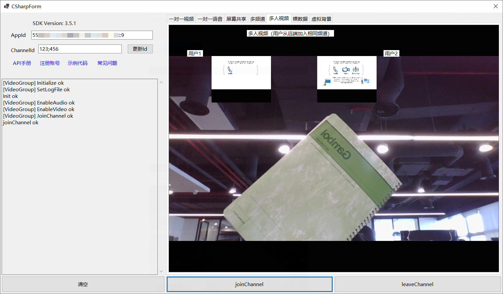

# API-Example-CSharp

*Read this in other languages: [English](README.md)*

## 简介

这个开源示例项目演示了不同场景下，Agora SDK 的基本集成逻辑。 项目中每个 Scene 都是一个独立的场景，都可以成功独立运行。

在这个示例项目中包含的所有场景都可以独立运行：

*项目运行效果图*



## 项目结构

* **基础案例:**

| Function                                          | Location                                         |
| --------------------------------------------------|--------------------------------------------------|
| 一对一语音通话                                    | [JoinChannelAudio][JoinChannelAudioLink]         |
| 一对一视频通话                                    | [JoinChannelVideo][JoinChannelVideoLink]         |
| ...                                               | ...                                              |

* **进阶案例:**

| Function                                          | Location                                         |
| --------------------------------------------------|--------------------------------------------------|
| 多频道                                            | [JoinMultipleChannel][JoinMultipleChannelLink]   |
| 祼数据                                            | [ProcessRawData][ProcessRawDataLink]             |
| 屏幕共享                                          | [ScreenShare][ScreenShareLink]                   |
| 多人视频                                          | [VideoGroup][VideoGroupLink]                     |
| 虚拟背景                                          | [VirtualBackground][VirtualBackgroundLink]       |
| ...                                               | ...                                              |

## 如何运行示例程序

### 运行环境

- Visual Studio 2019+ with C++ (Windows)
- .NET

### 运行步骤

*从拉取仓库到成功运行的全部步骤*

首先在 [Agora.io 注册](https://dashboard.agora.io/cn/signup/) 注册账号，获取 AppID 后，按以下步骤操作。

1. Clone仓库

   ```bash
   git clone https://github.com/AgoraIO-Community/Agora-C_Sharp-SDK.git
   ```

   ```bash
   git checkout dev/3.5.0.3
   ```

2. 使用 Visual Studio 打开`Agora-C_Sharp-SDK/CSharp-API_Example/CSharp-API_Example.sln`解决方案，选择x64平台。
注意：此时还没有下载SDK，直接编译会有编译错误。

3. 通过以下任意一种方式下载SDK：

  a. 下载[Agora Video SDK for Windows](https://docs.agora.io/cn/Agora%20Platform/downloads)，解压后把`RTC/Agora_Native_SDK_for_Windows_FULL/libs/x86_64`以及`x64/Release` 目录下所有的 `.dll` 文件复制到`Agora-C_Sharp-SDK/CSharp-API_Example/binx64/Debug/netcoreapp3.1` 文件夹中。
  
  b. 在`解决方案管理器`中，找到`CSharp-API_Example->依赖项`，右键选择`管理 Nuget 程序包`。点击`浏览`按钮，搜索`agora_rtc_sdk`包并安装。

4. 将 APPID 填入,点“更新”按钮，保存一下。选择想要运行的 Scene 运行程序。

一切就绪。你可以自由探索示例项目，体验 SDK 的丰富功能。

## 反馈

如果您对示例项目有任何问题或建议，请随时提交问题。

## 参考文档

- 您可以在 [文档中心](https://docs.agora.io/cn/Video/API%20Reference/unity/index.html)找到完整的API文档

- 有关屏幕共享和转码等高级功能，请参阅 [this repo](https://bit.ly/2RRP5tK), 文档 [advanced guides](https://docs.agora.io/en/Interactive%20Broadcast/media_relay_unity?platform=Unity) 

## 相关资源

- 你可以先参阅[常见问题](https://docs.agora.io/cn/faq)
- 如果你想了解更多官方示例，可以参考[官方 SDK 示例](https://github.com/AgoraIO)
- 如果你想了解声网 SDK 在复杂场景下的应用，可以参考[官方场景案例](https://github.com/AgoraIO-usecase)
- 如果你想了解声网的一些社区开发者维护的项目，可以查看[社区](https://github.com/AgoraIO-Community)
- 若遇到问题需要开发者帮助，你可以到[开发者社区](https://rtcdeveloper.com/)提问
- 如果需要售后技术支持, 你可以在[Agora Dashboard](https://dashboard.agora.io/)提交工单

## 代码许可

示例项目遵守 MIT 许可证。


[JoinChannelAudioLink]:https://github.com/AgoraIO-Community/Agora-C_Sharp-SDK/blob/dev/3.5.0.3/CSharp-API_Example/src/Basic/JoinChannelAudio/JoinChannelAudio.cs
[JoinChannelVideoLink]:https://github.com/AgoraIO-Community/Agora-C_Sharp-SDK/blob/dev/3.5.0.3/CSharp-API_Example/src/Basic/JoinChannelVideo/JoinChannelVideo.cs
[JoinMultipleChannelLink]:https://github.com/AgoraIO-Community/Agora-C_Sharp-SDK/blob/dev/3.5.0.3/CSharp-API_Example/src/Advanced/JoinMultipleChannel/JoinMultipleChannel.cs
[ProcessRawDataLink]:https://github.com/AgoraIO-Community/Agora-C_Sharp-SDK/blob/dev/3.5.0.3/CSharp-API_Example/src/Advanced/ProcessRawData/ProcessRawData.cs
[ScreenShareLink]:https://github.com/AgoraIO-Community/Agora-C_Sharp-SDK/blob/dev/3.5.0.3/CSharp-API_Example/src/Advanced/ScreenShare/ScreenShare.cs
[VideoGroupLink]:https://github.com/AgoraIO-Community/Agora-C_Sharp-SDK/blob/dev/3.5.0.3/CSharp-API_Example/src/Advanced/VideoGroup/VideoGroup.cs
[VirtualBackgroundLink]:https://github.com/AgoraIO-Community/Agora-C_Sharp-SDK/blob/dev/3.5.0.3/CSharp-API_Example/src/Advanced/VirtualBackground/VirtualBackground.cs
