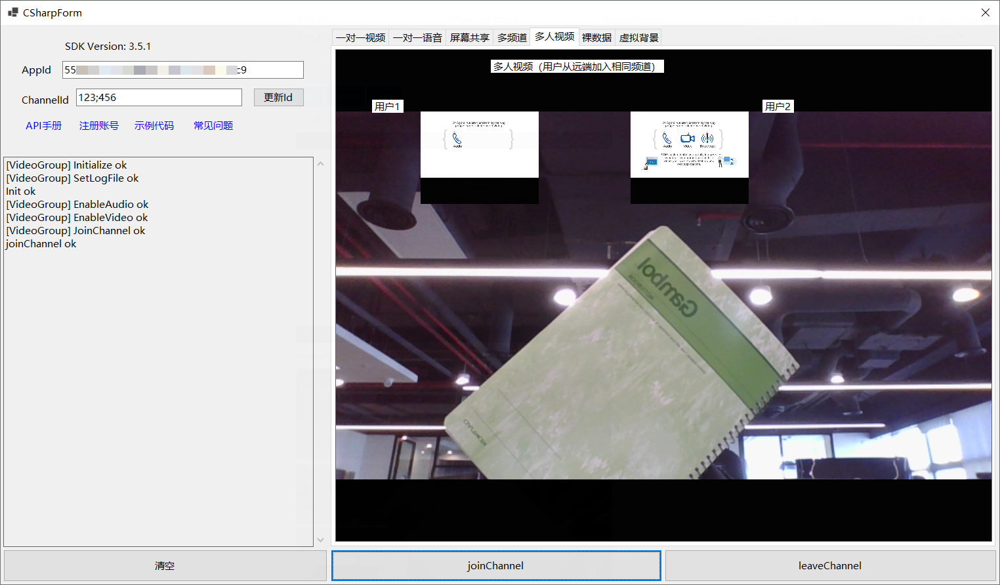

# APIExample


*Read this in other languages: [English](README.md)*

## 简介

这个开源示例项目演示了不同场景下，Agora SDK 的基本集成逻辑。 项目中每个 Scene 都是一个独立的场景，都可以成功独立运行。

在这个示例项目中包含的所有场景都可以独立运行：

*项目运行效果图*




## 项目结构

* **基础案例:**

| Demo                                     | Description                | APIs                                                                     |
| ---------------------------------------- | -------------------------- | ------------------------------------------------------------------------ |
| [JoinChannelAudio][JoinChannelAudioLink] | 一对一语音通话             | CreateAgoraRtcEngine, Initialize, JoinChannel, LeaveChannel              |
| [JoinChannelVideo][JoinChannelVideoLink] | 一对一视频通话             | CreateAgoraRtcEngine, Initialize, EnableVideo, JoinChannel, LeaveChannel |
| ...                                      | ...                        | ...                                                                      |

* **进阶案例:**

| Demo                                           | Description       | APIs                                                                                             |
| ---------------------------------------------- | ----------------- | ------------------------------------------------------------------------------------------------ |
| [JoinMultipleChannel][JoinMultipleChannelLink] | 多频道            | CreateAgoraRtcEngine, Initialize, SetChannelProfile, CreateChannel, SetClientRole, EnableAudio、EnableVideo、SetupLocalVideo, JoinChannel, Publish, LeaveChannel |
| [ProcessRawData][ProcessRawDataLink]           | 祼数据            | CreateAgoraRtcEngine, Initialize, EnableAudio, EnableVideo, JoinChannel, LeaveChannel             |
| [ScreenShare][ScreenShareLink]                 | 屏幕共享          | CreateAgoraRtcEngine, Initialize, StartScreenCaptureByDisplayId, EnableVideo,JoinChannel, StopScreenCapture, LeaveChannel |
| [VideoGroup][VideoGroupLink]                   | 多人视频          | CreateAgoraRtcEngine, Initialize, EnableVideo, JoinChannel, LeaveChannel                          |
| [VirtualBackground][VirtualBackgroundLink]     | 虚拟背景          | CreateAgoraRtcEngine, Initialize, EnableVideo, EnableVirtualBackground, JoinChannel, LeaveChannel |

| [CustomCaptureVideo][CustomCaptureVideoLink]   | 自采集            | CreateAgoraRtcEngine, Initialize, EnableVideo, SetExternalVideoSource, JoinChannel, PushVideoFrame, LeaveChannel |
| [AudioMixing][AudioMixingLink]                 | 混音              | CreateAgoraRtcEngine, Initialize, EnableAudio, StartAudioMixing, JoinChannel, StopAudioMixing, LeaveChannel |
| [ChannelMediaRelay][ChannelMediaRelayLink]     | 跨频道连麦        | CreateAgoraRtcEngine, Initialize, EnableVideo, JoinChannel,startChannelMediaRelay, stopChannelMediaRelay, LeaveChannel |
| [DeviceManager][DeviceManagerLink]             | 设备管理          | CreateAgoraRtcEngine, Initialize, EnableAudio, EnableVideo, GetAgoraRtcVideoDeviceManager JoinChannel, GetAgoraRtcAudioPlaybackDeviceManager, GetAgoraRtcAudioRecordingDeviceManager,EnumerateVideoDevices, EnumeratePlaybackDevices EnumerateRecordingDevices,, LeaveChannel |
| [PlayEffect][PlayEffectLink]                   | 音效              | CreateAgoraRtcEngine, Initialize, EnableAudio, JoinChannel , PlayEffect, PauseEffect, ResumeEffect, StopEffect , LeaveChannel 
| [RtmpStreaming][RtmpStreamingLink]             | 旁路推流          | CreateAgoraRtcEngine, Initialize, EnableVideo, AddPublishStreamUrl, JoinChannel, RemovePublishStreamUrl, LeaveChannel |
| [SetEncryption][SetEncryptionLink]             | 加密              | CreateAgoraRtcEngine, Initialize, EnableVideo, EnableEncryptionMode, JoinChannel,  LeaveChannel |
| [SetLiveTranscoding][SetLiveTranscodingLink]   | 转码              | CreateAgoraRtcEngine, Initialize, EnableVideo, AddPublishStreamUrl,SetLiveTranscoding, JoinChannel, RemovePublishStreamUrl, LeaveChannel |
| [StreamMessage][StreamMessageLink]             | 发送消息          | CreateAgoraRtcEngine, Initialize, EnableVideo, JoinChannel, sendStreamMessage, LeaveChannel |
| [VoiceChanger][VoiceChangerLink]               | 变声              | CreateAgoraRtcEngine, Initialize, EnableVideo, SetVoiceBeautifierPreset, SetAudioEffectPreset, JoinChannel, SetVoiceBeautifierParameters, SetAudioEffectParameters, StopVoiceChanger, LeaveChannel |
| [StringUid][StringUidLink]                     | 字符串uid         | CreateAgoraRtcEngine, Initialize, EnableVideo, JoinChannelWithUserAccount, LeaveChannel |
| ...                                            | ...               | ...                                                                                               |

## 如何运行示例程序

### 运行环境

- Visual Studio 2019+ with C++ (Windows)
- .NET

### 运行步骤

*从拉取仓库到成功运行的全部步骤*

首先在 [Agora.io 注册](https://dashboard.agora.io/cn/signup/) 注册账号，获取 AppID 后，按以下步骤操作。

1. Clone仓库

   ```bash
   git clone https://github.com/AgoraIO/Agora-C_Sharp-SDK.git
   ```

   ```bash
   git checkout release/3.7.2.245
   ```

2. 使用 Visual Studio 打开`Agora-C_Sharp-SDK/APIExample/APIExample.sln`解决方案，选择x86 或 x64平台。
注意：此时还没有下载SDK，直接编译会有编译错误。

3. 第一次build APIExample时，visual studio 会自动下载SDK的nuget包。

    注意，APIExample已经自动配置了SDK的nuget包依赖。如果创建自己的example程序，需要在example的依赖项上管理nuget包，搜索agora_rtc_sdk，选择对应的稳定版本。

4. 将 APPID 填入,点“更新”按钮，保存一下。选择想要运行的 Scene 运行程序。

一切就绪。你可以自由探索示例项目，体验 SDK 的丰富功能。

## 反馈

如果您对示例项目有任何问题或建议，请随时提交问题。

## 参考文档

- 您可以在 [文档中心](https://docs.agora.io/cn/Video/API%20Reference/unity/index.html)找到完整的API文档

- 有关屏幕共享和转码等高级功能，请参阅 [this repo](https://bit.ly/2RRP5tK), 文档 [advanced guides](https://docs.agora.io/en/Interactive%20Broadcast/media_relay_unity?platform=Unity) 

## 相关资源

- 你可以先参阅[常见问题](https://docs.agora.io/cn/faq)
- 如果你想了解更多官方示例，可以参考[官方 SDK 示例](https://github.com/AgoraIO)
- 如果你想了解声网 SDK 在复杂场景下的应用，可以参考[官方场景案例](https://github.com/AgoraIO-usecase)
- 如果你想了解声网的一些社区开发者维护的项目，可以查看[社区](https://github.com/AgoraIO-Community)
- 若遇到问题需要开发者帮助，你可以到[开发者社区](https://rtcdeveloper.com/)提问
- 如果需要售后技术支持, 你可以在[Agora Dashboard](https://dashboard.agora.io/)提交工单

## 代码许可

示例项目遵守 MIT 许可证。

[JoinChannelAudioLink]:./APIExample/src/Basic/JoinChannelAudio/JoinChannelAudio.cs
[JoinChannelVideoLink]:./APIExample/src/Basic/JoinChannelVideo/JoinChannelVideo.cs
[JoinMultipleChannelLink]:./APIExample/src/Advanced/JoinMultipleChannel/JoinMultipleChannel.cs
[ProcessRawDataLink]:./APIExample/src/Advanced/ProcessRawData/ProcessRawData.cs
[ScreenShareLink]:./APIExample/src/Advanced/ScreenShare/ScreenShare.cs
[VideoGroupLink]:./APIExample/src/Advanced/VideoGroup/VideoGroup.cs
[VirtualBackgroundLink]:./APIExample/src/Advanced/VirtualBackground/VirtualBackground.cs
[CustomCaptureVideoLink]:./APIExample/src/Advanced/CustomCaptureVideo/CustomCaptureVideo.cs
[AudioMixingLink]:./APIExample/src/Advanced/AudioMixing/AudioMixing.cs
[ChannelMediaRelayLink]:./APIExample/src/Advanced/ChannelMediaRelay/ChannelMediaRelay.cs
[DeviceManagerLink]:./APIExample/src/Advanced/DeviceManager/DeviceManager.cs
[PlayEffectLink]:./APIExample/src/Advanced/PlayEffect/PlayEffect.cs
[RtmpStreamingLink]:./APIExample/src/Advanced/RtmpStreaming/RtmpStreaming.cs
[SetEncryptionLink]:./APIExample/src/Advanced/SetEncryption/SetEncryption.cs
[SetLiveTranscodingLink]:./APIExample/src/Advanced/SetLiveTranscoding/SetLiveTranscoding.cs
[StreamMessageLink]:./APIExample/src/Advanced/StreamMessage/StreamMessage.cs
[VoiceChangerLink]:./APIExample/src/Advanced/VoiceChanger/VoiceChanger.cs
[StringUidLink]:./APIExample/src/Advanced/StringUid/StringUid.cs
